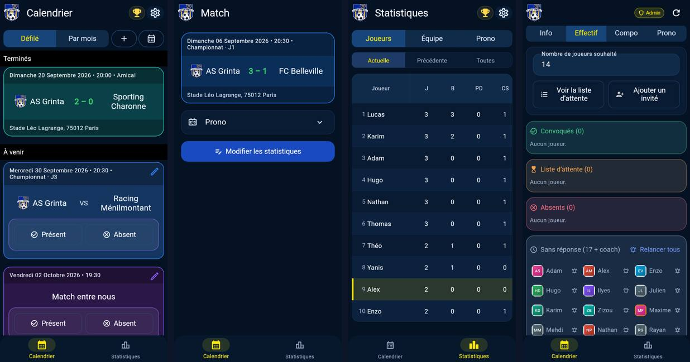
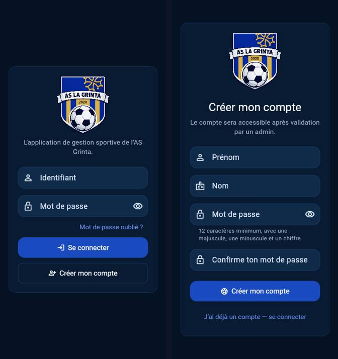
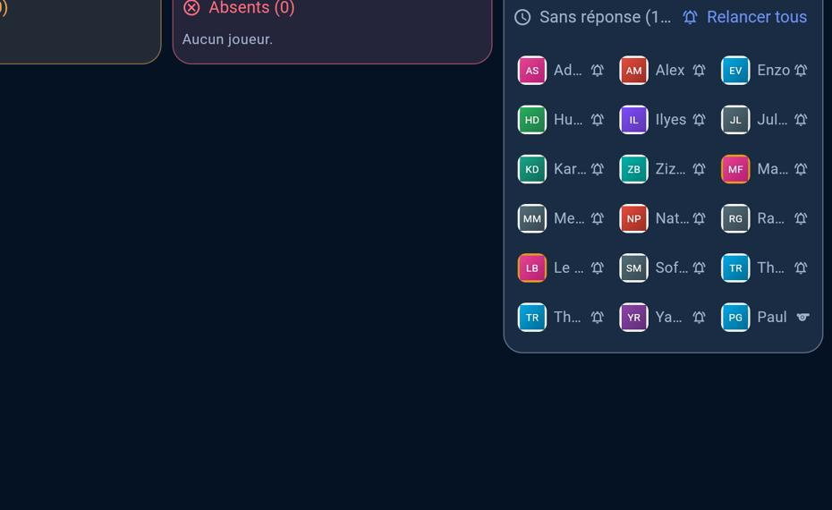

# Audit complet de l'application AS La Grinta

27 septembre 2026 · état du code au dernier commit de `main` (« Agrandit le terrain du match terminé… », n° 1395) et de la base de production le même jour.

## En bref

L'application est solide. La sécurité et la base de données sont au niveau d'un produit professionnel, et environ 2 000 vérifications automatiques passent toutes. J'ai trouvé des problèmes réels, mais ciblés : les liens des notifications ouvrent la mauvaise page, la base de production contient une protection qui n'existe pas dans le code, le test automatique de restauration des sauvegardes échoue depuis trois semaines, et un journal technique remplit peu à peu l'espace gratuit de la base.

| Mesure | Résultat |
|---|---|
| Reconstruction de la base à partir du code (596 étapes) | Sans erreur |
| Tests de la base et des règles d'accès | 108 fichiers, 1 237 vérifications, 0 échec |
| Tests de l'application | 748 tests, 0 échec |
| Tests des fonctions serveur | 21 tests, 0 échec |
| Tables de données protégées par des règles d'accès | 54 sur 54 |
| Écarts entre la base réelle et le code | 8 fonctions d'administration |
| Tâches automatiques exécutées en production depuis le 10 juillet | 370 641, aucune en échec |
| Taille de la base de production | 99 Mo sur 500 Mo gratuits, dont 70 Mo de journal technique |
| Code de l'application | 59 186 lignes, dont 1 712 jamais utilisées |

## Comment j'ai travaillé

- J'ai lu l'ensemble du code de l'application, du serveur, des tests, de la documentation et des 14 automatisations GitHub.
- J'ai reconstruit une copie complète de la base sur une machine isolée, à partir du seul code, puis j'y ai lancé tous les tests du projet.
- J'ai rempli cette copie avec de fausses données (18 joueurs fictifs, une saison, 6 matchs) et j'ai utilisé l'application comme un vrai membre : 32 pages ouvertes avec un compte administrateur, 7 avec un compte joueur, 6 en format ordinateur. Toutes les captures de ce dossier montrent ces données fictives.
- J'ai consulté la base réelle **en lecture seule** : structure, réglages de sécurité, tailles, nombres de lignes. Je n'ai lu aucune donnée personnelle et je n'ai rien modifié.
- J'ai comparé le code déployé sur le serveur avec celui du dépôt, et consulté l'historique des automatisations GitHub.

### Ce que je n'ai pas pu tester, et pourquoi

- **Un vrai téléphone.** Je n'en ai pas : j'ai utilisé un navigateur Chrome automatisé, au format téléphone et au format ordinateur. Le comportement propre à Safari sur iPhone n'est donc pas vérifié.
- **La réception réelle des notifications.** Il faut un téléphone et une autorisation donnée à la main. J'ai vérifié la page qu'ouvre une notification quand on la touche, pas son arrivée sur l'écran.
- **Les émojis des badges.** Ils viennent des polices de Google, bloquées dans mon environnement : les badges s'affichent chez moi avec un carré barré. Ce n'est pas un défaut de l'application, mais je n'ai pas pu en vérifier le rendu.
- **La restauration réelle d'une sauvegarde.** Il faut la clé de chiffrement, que je n'ai pas et que je ne dois pas avoir.
- **Les réglages de connexion de Supabase** (règles de mot de passe côté Supabase, e-mails). Ils ne sont visibles que dans le tableau de bord.
- **La tenue sous forte affluence.** Pas de test avec des dizaines de personnes connectées en même temps.

## Ce que fait l'application

Pour les joueurs : calendrier des matchs (liste et vue par mois), réponse présent ou absent, fiche de match avec composition sur le terrain, pronostics avec cotes et classement, vote pour l'homme du match, statistiques (joueurs, équipe, historique du club depuis 2013), armoire à badges (plus de 60 badges, attribués automatiquement ou à la main), déclaration d'indisponibilité, liste d'attente, bilan de fin de saison animé et partageable, agenda synchronisable, notifications sur le téléphone.

Pour les administrateurs : création et modification des matchs, gestion des convocations et de la liste d'attente, effectif et composition, invités, suivi du match en direct (chrono, buts, remplacements), compte rendu d'après-match, validation des nouveaux comptes, gestion des badges, messages aux joueurs, coupure générale des notifications.

C'est une application complète, nettement plus riche que ce qu'on trouve d'habitude pour un club amateur.

## Analyse détaillée

### Sécurité et données personnelles

C'est le point le plus fort du projet.

- Les 54 tables de la base ont toutes des règles d'accès, et chacune en a au moins une. Un visiteur non connecté ne peut lire aucune donnée du club ni lancer aucune action. Seules les images des badges et de l'application sont publiques, et c'est voulu.
- Un joueur ne peut modifier que son prénom, son nom, son surnom et sa photo. Il ne peut pas se donner le rôle d'administrateur : c'est bloqué deux fois, par les droits sur les colonnes et par un contrôle automatique.
- Les 124 fonctions à droits élevés que les membres peuvent appeler vérifient toutes qui les appelle. Les 359 fonctions de ce type, internes comprises, sont toutes protégées contre un détournement technique connu (le « chemin de recherche », fixé partout).
- Les photos de profil sont privées, visibles seulement par les membres actifs. Les raisons d'indisponibilité ne sont visibles que par l'intéressé et les administrateurs, et le vote pour l'homme du match reste anonyme.
- L'inscription publique est limitée en nombre de tentatives, et le lien d'agenda personnel repose sur un code impossible à deviner.
- L'outil d'alerte de Supabase signale deux points : les fonctions accessibles aux membres connectés (c'est voulu, et j'ai vérifié qu'elles contrôlent toutes les droits) et l'absence de vérification des mots de passe déjà piratés. Cette dernière option n'existe que dans les offres payantes de Supabase.

### Base de données et serveur

- La base se reconstruit entièrement à partir du code, et tous les tests passent sur cette copie.
- En comparant avec la production, tout est identique pour les tables, les règles d'accès, les vues, les index et les tâches planifiées. **Seule exception : 8 fonctions d'administration** (détail dans « À corriger »).
- Les fonctions serveur déployées (inscription, gestion des comptes, notifications, agenda) sont identiques au code, octet pour octet.
- Les 8 tâches automatiques (rappels, votes, météo, fin des matchs internes, bilans…) tournent sans aucun échec depuis juillet. En revanche, leur journal n'est jamais vidé (voir « À corriger »).
- L'envoi des notifications est bien pensé : nouvel essai en cas d'échec passager, message conservé 24 heures pour un téléphone éteint, nettoyage automatique des téléphones désinscrits.

### Application : code et fiabilité

- L'analyse automatique du code ne relève aucun avertissement, et les 748 tests passent.
- Le code est bien organisé par fonctionnalité et très commenté, en français, avec les raisons des choix. C'est rare et précieux.
- Environ 40 % du code est couvert par des tests. Les statistiques, le profil et l'administration ne le sont presque pas.
- 17 fichiers de tests vérifient le **texte** du code plutôt que son comportement. Ils cassent au moindre renommage, même sans effet réel, et l'un d'eux protège du code qui ne sert plus.
- La première ouverture de l'application télécharge 4 à 5 Mo (l'application compressée pèse 1,6 Mo, le moteur d'affichage 2 à 3 Mo). Les ouvertures suivantes sont rapides car tout est gardé en mémoire. L'application est à 93 % du plafond de poids que le projet s'est lui-même fixé.

### Écrans et ergonomie

- L'identité visuelle est cohérente : fond bleu nuit, couleurs du club, écusson, cartes de match colorées selon leur statut. L'ensemble fait professionnel.
- Sur ordinateur, un menu latéral remplace la barre du bas et les statistiques affichent plus de colonnes. Un défaut visible toutefois : dans l'écran Effectif, les prénoms sont coupés à 2 ou 3 lettres (voir « Doit être amélioré »).
- Les accès sont bien cloisonnés : un joueur qui tape l'adresse d'une page d'administration est renvoyé au calendrier.
- Tous les indicateurs de chargement ont été rendus invisibles volontairement. Sur un réseau lent, l'écran paraît vide ou figé.
- Quelques textes sont maladroits ou périmés, et les colonnes de statistiques utilisent des abréviations (J, B, PD, CS, HDM…) sans légende.

### Mise en ligne, sauvegardes et surveillance

- Chaque modification passe par des contrôles automatiques avant d'être publiée. Le site se met à jour tout seul et les tests de l'application sont au vert.
- Une sauvegarde chiffrée de la production est faite chaque semaine, et les 5 dernières ont réussi.
- **Mais le test automatique qui vérifie qu'on sait restaurer ces sauvegardes échoue depuis le 20 septembre** (voir « À corriger »).
- Un garde-fou vérifie que la liste des modifications de la base est la même en production et dans le code. Il ne compare pas leur contenu, et c'est pourquoi l'écart des 8 fonctions lui a échappé.
- L'onglet « Actions » de GitHub garde la trace de 426 automatisations. La plupart étaient ponctuelles et n'existent plus, ce qui noie les 14 vraies.

### Documentation

Elle est abondante, en français, et explique les règles de fonctionnement. Quelques passages sont périmés, dont un dans le fichier que lisent les assistants IA : il annonce encore trois rôles (dont « modérateur ») alors qu'il n'en existe plus que deux. Un assistant qui s'y fie peut se tromper.

## À corriger

Ce sont des défauts réels, vérifiés, qui touchent les joueurs, les administrateurs ou la sécurité des données.

### 1. Le lien d'inscription copié depuis l'administration ouvre la page de connexion

**Ce qui se passe.** Le bouton « Lien d'inscription » copie une adresse que l'application ne comprend pas. Le nouveau joueur qui l'ouvre arrive sur l'écran de connexion au lieu du formulaire d'inscription.

**Pour vous.** Les nouveaux venus doivent trouver eux-mêmes le bouton « Créer mon compte ». Certains abandonnent ou demandent de l'aide.

**Ce que je propose.** Apprendre à l'application à comprendre les deux formes d'adresse. La même correction règle aussi le point suivant.

**Vérifié** sur une copie identique au site publié : l'adresse copiée mène à la connexion, la même adresse écrite sous l'autre forme mène bien au formulaire.

### 2. Toucher une notification n'ouvre pas la bonne page

**Ce qui se passe.** Les notifications « vote pour l'homme du match », « effectif / composition » et « nouveau compte à valider » contiennent une adresse que l'application ne lit pas. Elle s'ouvre sur le calendrier. Deuxième problème, indépendant : ouvrir ou rafraîchir directement la page Effectif d'un match renvoie vers la page des pronostics de ce match. L'application décide trop tôt, avant d'avoir chargé les réglages du club.

**Pour les joueurs.** Ils doivent chercher eux-mêmes le vote ou l'effectif. C'est précisément ce que la notification devait leur éviter, et la participation au vote peut en souffrir.

**Ce que je propose.** La même correction que pour le lien d'inscription, puis attendre les réglages du club avant de décider où envoyer l'utilisateur.

**Vérifié** connecté en joueur puis en administrateur : les trois notifications ouvrent le calendrier (3 cas sur 3), et la page Effectif ouverte directement renvoie aux pronostics (6 essais sur 6).

### 3. La base réelle contient une protection absente du code

**Ce qui se passe.** En production, 8 actions d'administration (convocations, effectif, invités, disponibilités) sont bloquées à partir de l'ouverture du Live, 15 minutes avant le match. Cette protection a été ajoutée directement sur la base, sans passer par le code. Le code, lui, contient l'ancienne version sans ce blocage.

**Pour vous.** Tant que rien ne bouge, tout va bien. Mais deux situations ordinaires suffiraient à perdre la protection sans que personne ne s'en rende compte :

- la prochaine modification d'une de ces actions, faite à partir du code, remplacerait la version de production par l'ancienne ;
- une reconstruction de la base après un incident la ferait aussi disparaître.

Les contrôles automatiques ne le détectent pas.

**Ce que je propose.** Recopier dans le code la version exacte de la production (une petite modification de base, avec un test), puis ajouter un contrôle qui compare le contenu des fonctions, et pas seulement leur liste.

**Vérifié** en comparant la production et la copie reconstruite, fonction par fonction : ces 8 fonctions diffèrent réellement. 11 autres ne diffèrent que par des commentaires ou des espaces, sans effet. Le reste (742 colonnes, 144 règles d'accès, 199 index, 8 tâches planifiées) est identique.

### 4. Le test de restauration des sauvegardes échoue depuis trois semaines

**Ce qui se passe.** La sauvegarde hebdomadaire fonctionne. Mais le test automatique qui vérifie qu'on saurait la **remettre en place** échoue les 20, 21 et 27 septembre, à l'étape de restauration de la base. Il réussissait encore les 6 et 13 septembre. La sauvegarde contient une table récente du système de connexion de Supabase, que l'outil utilisé pour le test ne connaît pas encore.

**Pour vous.** Aujourd'hui, personne ne sait si une restauration réussirait de bout en bout. En cas d'incident, la procédure buterait au minimum sur ce point, au pire moment.

**Ce que je propose.** Mettre à jour la version de l'outil Supabase utilisée par ce test et par la procédure de restauration, puis relancer le test jusqu'au vert.

**Vérifié** dans l'historique GitHub : les trois derniers passages échouent sur le message « la table auth.mfa_recovery_code_sets n'existe pas ». Les sauvegardes elles-mêmes réussissent.

### 5. Un journal technique remplit peu à peu la base gratuite

**Ce qui se passe.** Chaque exécution d'une tâche automatique laisse une ligne dans un journal que rien ne vide. Six tâches tournent chaque minute. Ce journal pèse déjà 70 Mo sur les 99 Mo de la base (370 641 lignes depuis le 10 juillet) et grossit d'environ 1,5 Mo par jour.

**Pour vous.** L'offre gratuite de Supabase est limitée à 500 Mo. À ce rythme, la limite serait atteinte vers juin 2027, et plus tôt si d'autres tâches sont ajoutées. Supabase peut alors passer la base en lecture seule : plus aucune réponse, prono ou vote ne s'enregistrerait.

**Ce que je propose.** Une tâche de nettoyage nocturne qui ne garde que les 7 derniers jours de ce journal. C'est une petite modification de base, sans effet sur les données du club.

**Vérifié** en production, en lecture seule (tailles et nombres de lignes seulement).

### 6. Les badges affichés à côté des prénoms ne se mettent pas à jour

**Ce qui se passe.** Quand un joueur change le badge qu'il met en avant, ou en débloque un nouveau, l'ancien reste affiché à côté de son prénom dans les classements et les statistiques, jusqu'à ce que l'application soit complètement rechargée. L'application rafraîchit la mauvaise liste, une ancienne qui n'est plus affichée nulle part.

**Pour les joueurs.** Gêne mineure, mais visible : le choix fait dans l'armoire semble ne pas marcher.

**Ce que je propose.** Rafraîchir la bonne liste et supprimer l'ancienne.

**Vérifié** en lisant le code. Je ne l'ai pas reproduit à l'écran.

### 7. La règle de mot de passe accepte un mot de passe sans majuscule

**Ce qui se passe.** La règle demande « une majuscule », mais une lettre accentuée minuscule (é, è, à…) est comptée comme une majuscule. Exemple : « aaaaaaaaaaé1 » est accepté.

**Pour vous.** Des mots de passe un peu plus faibles que ce qui est annoncé. Par ailleurs, si l'option de Supabase qui impose des caractères précis est activée, une majuscule accentuée (É) pourrait faire échouer une inscription avec un message vague. Je n'ai pas pu voir ce réglage.

**Ce que je propose.** Corriger la règle aux deux endroits où elle est écrite, dans l'application et sur le serveur.

**Vérifié** en testant la règle sur des exemples.

## Doit être amélioré

Rien n'est cassé ici, mais ces points dégradent l'usage, la clarté ou la maintenance.

### 1. Des messages d'erreur vagues, ou au contraire trop techniques

- À l'inscription, le serveur explique précisément ce qui ne va pas (« trop de tentatives », règle du mot de passe…). L'application remplace ces explications par « La création du compte a échoué ». C'est pareil pour la réinitialisation et la suppression de comptes côté administration.
- À l'inverse, 5 endroits affichent le message technique brut. La page de préparation du Live va jusqu'à montrer une trace technique complète à l'entraîneur.
- **Proposition :** transmettre les messages du serveur tels quels quand ils sont en français, et un message simple sinon.

### 2. Une action ratée fait disparaître tout le calendrier

Si l'annulation d'un match, la clôture d'un match interne ou la création d'un adversaire échoue, le calendrier entier est remplacé par une carte « Matchs indisponibles ». Un message sur l'action ratée suffirait, en gardant le calendrier visible.

### 3. Aucun signe de chargement

Tous les indicateurs de chargement sont volontairement invisibles. Sur un réseau lent, les écrans paraissent vides, et certains boutons deviennent blancs pendant l'enregistrement. On ne sait plus si l'appui a été pris en compte, alors on appuie une deuxième fois. **Proposition :** au minimum, un texte « Enregistrement… » sur les boutons, comme le font déjà quelques écrans.

### 4. Se déconnecter ne coupe pas les notifications de l'appareil

Après une déconnexion, le téléphone continue de recevoir les notifications du compte précédent. Sur un appareil prêté ou partagé, une autre personne les voit. La fonction qui désinscrit l'appareil existe déjà : il suffit de l'appeler à la déconnexion.

### 5. Couper toutes les notifications du club se fait sans confirmation

Le bouton administrateur « Désactiver toutes les notifications » agit dès le premier appui, pour tout le club. Une confirmation éviterait une coupure accidentelle.

### 6. Écran Effectif sur ordinateur : prénoms illisibles

Dans la colonne « Sans réponse », les prénoms sont coupés à 2 ou 3 lettres. Thomas et Théo deviennent tous deux « Th… », avec les mêmes initiales. Le titre de la colonne est lui-même coupé.

### 7. Un texte périmé sur l'entraîneur

Dans la liste des joueurs, l'entraîneur est encore décrit comme « hors effectif ». Ce n'est plus vrai depuis le 15 septembre : il compte désormais comme un membre ordinaire.

### 8. Une documentation en partie périmée

Le guide lu par les assistants IA annonce trois rôles au lieu de deux. Une page sur la sécurité et des notes internes parlent encore du rôle « modérateur » et d'une ancienne procédure de rattachement de compte. Un message d'automatisation cite 427 étapes au lieu de 596. Les assistants s'appuient sur ces textes, et des erreurs de leur part peuvent en découler.

### 9. Des tests à renforcer là où il n'y en a pas

- Les écrans de statistiques, de profil et d'administration sont presque sans tests. Ce sont pourtant ceux que les joueurs et vous utilisez le plus.
- 17 fichiers de tests (1 597 lignes) vérifient le texte du code et non son comportement. Ils ralentissent les évolutions sans vraiment protéger. Il vaut mieux les remplacer au fur et à mesure par de vrais tests.

### 10. Un contrôle automatique qui ne peut jamais échouer

L'étape qui analyse les fonctions de la base est configurée pour ne jamais bloquer. En plus, elle affiche 16 fausses alertes. Soit on la rend utile (échec en cas de vraie erreur, sans les fausses alertes), soit on la retire.

## Peut être amélioré

Confort, finition et prévention. Rien d'urgent.

- **Textes.** « Envoyer un notif. » devient « Envoyer une notif. » et « Ouverture pronostique » devient « Ouverture des pronos ». L'erreur de connexion répète deux fois « Connexion impossible ». « VALIDER LE COMPTE RENDU » est en majuscules alors que tous les autres boutons ne le sont pas.
- **Statistiques.** Ajouter une légende ou des intitulés complets pour J, B, PD, CS, HDM, G, N, P.
- **Pronostics.** Les cotes s'affichent multipliées par 100 (« 195 » pour 1,95). Écrire « 195 pts » rendrait l'idée claire.
- **Match terminé.** Afficher les buteurs et l'homme du match sous le score, même quand aucune composition n'a été publiée. Aujourd'hui, ils ne sont visibles que sur le terrain dessiné.
- **Match à venir, vue joueur.** Les cartes « Effectif » et « Composition » s'affichent même quand rien n'est encore publié. On clique pour trouver une page vide.
- **Surnoms.** La liste des utilisateurs est triée par prénom mais affiche le surnom : « Zizou » se retrouve entre Karim et Maxime. Les initiales mélangent surnom et nom (« LB » pour « Le Mur »).
- **Compteurs.** L'effectif affiche « Sans réponse (17 + coach) » côté administration et « Sans réponse (18) » côté joueur.
- **Liste des matchs (administration).** Les titres se coupent au milieu d'un nom d'équipe (« AS Pantin 2 - 2 AS / Grinta »).
- **Calendrier.** En faisant défiler, le bandeau « Terminés » reste collé au-dessus de « À venir », sans contenu.
- **Numéros de journée.** Ils sont attribués dans l'ordre de création des matchs, pas dans l'ordre des dates. Il faut les corriger à la main si un match est créé en retard.
- **Météo.** La recherche de la ville ne précise pas le pays : une ville homonyme à l'étranger pourrait être choisie. Aucun cas constaté, mais ajouter « France » à la recherche coûte une ligne.
- **Cotes.** Le calcul n'a pas de plafond. Sur une base sans historique, il produit des cotes absurdes (jusqu'à 1 000 001). Ce n'est pas le cas en production, où la cote la plus haute est 9,98 grâce à l'historique importé. Un plafond (20, par exemple) éviterait toute surprise.
- **Indisponibilités.** La raison est obligatoire et en texte libre. Elle peut donc contenir une information de santé. La rendre facultative, ou proposer des choix (vacances, blessure, autre), réduirait les données sensibles collectées.
- **Agenda synchronisé.** Les lignes longues sont découpées par caractère plutôt que par octet. Les agendas le tolèrent, mais c'est hors norme avec les accents.
- **Poids au premier chargement** (4 à 5 Mo). À surveiller, surtout pour les joueurs avec peu de données mobiles.
- **Onglet Actions de GitHub.** Désactiver ou supprimer les 400 anciennes automatisations ponctuelles pour retrouver facilement les 14 vraies.
- **Deux fonctions serveur retirées** (ancien rattachement de compte, anciens rappels de prono) sont encore en ligne et répondent « supprimée ». On peut les effacer du serveur.
- **Protection contre les mots de passe piratés.** Elle n'est disponible qu'avec une offre Supabase payante. À envisager si le club passe un jour à l'offre supérieure.
- **Droits techniques.** La copie reconstruite à partir du code donne quelques droits techniques de plus que la production. C'est sans effet par l'application, mais aligner le code sur la production serait plus propre.

## Fonctionne parfaitement

Vérifié par des tests, par la comparaison avec la production ou par l'usage réel sur la copie.

- **Sécurité des données.** Règles d'accès sur 100 % des tables, rôles impossibles à usurper, fonctions sensibles verrouillées, photos privées, vote anonyme, raisons d'indisponibilité confidentielles, inscription limitée en tentatives.
- **Base de données.** Elle se reconstruit à l'identique à partir du code, et 1 237 vérifications passent sans échec. Tables, règles, vues, index et tâches sont identiques à la production (hors les 8 fonctions citées plus haut).
- **Règles métier protégées côté serveur.** Pronostics fermés 15 minutes avant le coup d'envoi, compte rendu impossible avant le match (vérifié), verrouillages après le Live, dates et heures calculées à l'heure de Paris.
- **Tâches automatiques.** 370 641 exécutions depuis juillet, aucune en échec.
- **Fonctions serveur.** Code en ligne identique au dépôt, 21 tests réussis, contrôle de sécurité réussi.
- **Notifications.** Nouvel essai automatique, conservation 24 heures, nettoyage des téléphones désinscrits, coupure générale pour les phases de test.
- **Application.** Aucun avertissement de l'analyse de code, 748 tests réussis, construction du site sans erreur. Toutes les pages testées s'ouvrent avec les données de la copie, sans erreur de l'application dans le navigateur.
- **Cloisonnement des accès.** Un joueur ne peut pas ouvrir les pages d'administration, et le serveur refuse de toute façon les actions interdites.
- **Calcul des points de pronostic.** Identique entre l'application et la base. Les classements gèrent correctement les égalités (deux 8ᵉ, puis 10ᵉ).
- **Statistiques.** Les nombres de matchs, buts et clean sheets de mes données fictives sont exacts.
- **Sauvegarde hebdomadaire chiffrée.** Les 5 dernières exécutions ont réussi (c'est le test de restauration qui échoue, voir plus haut).
- **Mise en ligne.** Publication automatique du site et contrôles avant publication au vert. La liste des modifications de la base est identique entre le code et la production (596).

## Idées d'amélioration et de nouvelles fonctionnalités

- **Répondre depuis la notification.** Des boutons « Présent » et « Absent » directement dans la notification d'ouverture des disponibilités. C'est le geste le plus fréquent du club.
- **Carte « Mon prochain match ».** En haut du calendrier : heure, rendez-vous, maillot, météo, ma réponse et ma place (convoqué ou liste d'attente), tout au même endroit.
- **Covoiturage pour les matchs à l'extérieur.** Qui a de la place, qui cherche une voiture.
- **Feuille d'équipe partageable.** Une image propre de la composition, à envoyer dans le groupe de discussion du club (le partage d'image existe déjà pour le bilan de saison).
- **Rapport de santé hebdomadaire.** Un e-mail automatique à l'administrateur avec l'état des sauvegardes, du test de restauration, de la taille de la base et des erreurs de la semaine. Les points 4 et 5 de « À corriger » auraient été repérés tout de suite.
- **Mes données.** Une page simple où chaque membre voit et exporte ce que le club conserve sur lui. C'est une bonne pratique au regard du RGPD. Une ancienne version avait été retirée car inaccessible.
- **Thème clair.** Pour lire l'application en plein soleil au bord du terrain.
- **Plusieurs clubs.** Si vous envisagez de proposer l'application à d'autres clubs, il faudrait la rendre multi-clubs (logo, couleurs et données propres à chacun).

## Ce qui reste à faire

### Ce que je peux faire, si vous le souhaitez

1. Corriger les liens : inscription, notifications et ouverture directe de la page Effectif.
2. Préparer la modification qui recopie dans le code les 8 fonctions de production, avec un contrôle qui compare désormais le contenu des fonctions.
3. Ajouter le nettoyage automatique du journal technique.
4. Réparer le test de restauration des sauvegardes.
5. Corriger les badges, la règle de mot de passe, les messages d'erreur, la déconnexion, la confirmation de coupure des notifications, l'écran Effectif sur ordinateur, les textes et la documentation.
6. Supprimer le code inutile listé plus bas, dans une modification séparée et testée.

Je recommande de commencer par les points 2, 3 et 4 (données et sauvegardes), puis le point 1 (le plus visible pour les joueurs).

### Ce qui demande une action de votre part

1. **Relire et accepter** les modifications que je proposerai.
2. **Lancer le déploiement de la base** (l'automatisation « Deploy Supabase production », avec l'option d'application des modifications). Vous êtes la seule personne à en avoir les droits, et les points 2 et 3 n'agissent qu'après ce lancement.
3. **Décider** du sort des éléments « à votre choix » listés plus bas : configuration Replit, archive d'import SportEasy, anciennes archives SQL.
4. **Facultatif :** nettoyer l'onglet Actions de GitHub, et réfléchir à l'offre Supabase si la protection des mots de passe piratés vous importe.

## Code inutile : ce qui peut être supprimé sans rien changer à l'application

Je ne compte ici que ce que j'ai prouvé. Chaque élément a été vérifié de trois façons : le graphe complet des fichiers réellement chargés par l'application, une recherche de toutes les utilisations, et la lecture du code.

### Chiffres sûrs

**1 712 lignes de l'application ne sont jamais exécutées**, soit 2,9 % du code. S'y ajoutent **225 lignes de tests** qui ne testent que ce code-là. Total : **1 937 lignes**.

| Élément | Lignes |
|---|---|
| 9 fichiers entiers jamais chargés (ancien export d'agenda, ancien compte rendu, ancienne carte des buteurs, simulation d'équipes internes…) | 784 |
| Ancienne section « historique des pronos », plus affichée nulle part | 424 |
| Anciennes façons de créer et modifier un match, remplacées par les nouvelles | 414 |
| Ancienne liste des badges mis en avant, jamais affichée (c'est elle que l'application rafraîchit à tort, voir « À corriger » n° 6) | 62 |
| Restes du bonus ×2, supprimé du jeu (il laisse aussi une colonne vide dans les lignes de pronos) | 28 |
| **Sous-total application** | **1 712** |
| Tests qui ne vérifient que ce code mort | 225 |
| **Total** | **1 937** |

**Côté serveur, 342 lignes** : 2 fonctions retirées mais encore déployées (48 lignes) et 3 anciens scripts de test que rien ne lance, dont 2 échouent de toute façon sur une base vide (294 lignes).

### Fichiers supprimables sans aucun effet

- Le dossier `logo-pack` (7 images, 1,4 Mo) : 4 copies exactes des icônes du site et 3 images non utilisées.
- 4 images inutilisées dans `assets/images` (logos MPG et SportEasy, 1,7 Mo), plus 2 fichiers d'arrière-plan jamais affichés mais embarqués dans l'application (72 Ko).
- 8 fichiers d'une ligne dans `.github`, qui servaient à relancer des automatisations, et un marqueur de déploiement publié sur le site.
- Le dossier `supabase/migrations_legacy_synthetic` : 408 fichiers, 58 503 lignes, 3 Mo. C'est une ancienne tentative de reconstruction. Seul un fichier vide qu'il contient sert encore de repère à une automatisation ponctuelle.

### Quasi sûr

Le mode « aperçu » du bilan de saison (environ 100 lignes) n'est plus atteignable dans l'application : seul un test l'utilise. Je le chiffrerai exactement au moment de le supprimer.

### À garder

- Les copies d'origine des anciennes modifications de base (`migrations_legacy_production`) : c'est l'archive de ce qui a vraiment été appliqué.
- Les 425 modifications « de remplacement » du dossier des migrations : les règles du projet interdisent d'y toucher.
- Les scripts de retour arrière et de diagnostic.

### À votre choix

- La configuration Replit : elle ne sert que si vous utilisez encore Replit pour prévisualiser.
- L'archive d'import SportEasy (2,2 Mo) : elle ne contient ni e-mail ni téléphone, mais retrace l'historique des matchs du club. On peut la sortir du dépôt si elle n'est plus utile.

## Bilan

Oui, c'est du bon travail, au-dessus de ce qu'on voit d'habitude pour un club amateur. La sécurité et la base de données sont au niveau d'un produit professionnel, et environ 2 000 vérifications automatiques passent toutes. Les défauts sont réels mais ciblés (liens des notifications, écart entre la base et le code, sauvegardes non vérifiées, journal qui remplit la base) et se corrigent en quelques jours. D'après l'historique, l'application a été construite en 12 semaines environ, de début juillet à fin septembre 2026, avec près de 1 400 modifications ; sans assistance IA, un développeur expérimenté y aurait passé 8 à 10 mois. Faite par un prestataire, elle coûterait autour de 80 000 € ; vendue telle quelle à un autre club, il faudrait plutôt viser 15 000 à 20 000 €, car elle est taillée pour l'AS Grinta et demanderait une adaptation.

## Annexe technique (pour la personne qui fera les corrections)

Références précises, à l'état du commit `72c1d19`.

**À corriger**

1. Liens d'inscription et de notification : `lib/app/router/initial_app_location_web.dart` ne lit que `window.location.hash`, alors que `lib/features/admin/presentation/admin_page.dart:20` (`_registerLink`) et les charges utiles de notification construisent des chemins : `'matches/<id>/vote'` et `'/lineup?section=effectif'` dans les fonctions SQL (dernière version dans `20260915093000_coach_is_a_regular_member.sql`), `"admin/administration"` dans `supabase/functions/send-push/index.ts`, résolus par `web/sw.js` (`new URL(url, registration.scope)`). GitHub Pages sert alors `404.html` et l'application démarre sur `/`.
2. Retour vers `/prediction` : `lib/app/router/app_router.dart:84` lit `sportsManagementEnabledProvider`, qui vaut `false` tant que `featureFlagsControllerProvider` charge (`feature_flags_controller.dart:206`). La règle `auth_redirect.dart:88-95` redirige alors `/matches/:id/lineup` vers `/prediction`, et la destination est perdue.
3. Écart avec la production : les fonctions `public.admin_add_or_reuse_match_guest`, `admin_configure_match_sport_workflow`, `admin_override_match_availability`, `admin_publish_match_convocations`, `admin_recompute_match_convocations`, `admin_save_match_effectif`, `admin_set_match_convocation` et `admin_sync_match_sport_workflow`. En production : `SECURITY DEFINER`, contrôle `private.is_admin()` et `perform private.assert_match_admin_edit_open(p_match_id)` ; `admin_save_match_effectif` délègue à `admin_publish_match_effectif`. Aucune migration enregistrée en production ne contient ces définitions : elles ont été appliquées hors migration. Les droits `TRUNCATE`, `TRIGGER` et `REFERENCES` ont été retirés en production, mais pas dans la base rejouée.
4. Test de restauration : `.github/workflows/backup_restore_drill.yml`, étape « Restore database backup », erreur `relation "auth.mfa_recovery_code_sets" does not exist`. Le schéma `auth` de la pile locale (CLI 2.111.0) est plus ancien que celui de la production.
5. Journal : `cron.job_run_details` compte 370 641 lignes pour 70 Mo et environ 7 600 lignes par jour. Ajouter une tâche `cron` quotidienne `delete from cron.job_run_details where end_time < now() - interval '7 days'`.
6. Badges : `statisticsBadgeEmblemsProvider` (`lib/features/badges/data/statistics_badge_emblems_provider.dart`, non `autoDispose`) n'est jamais invalidé. Les invalidations visent `featuredBadgesProvider`, jamais écouté : `armoire_page.dart:32`, `badge_image_editor.dart:104`, `core/sync/shared_data_sync.dart:263`.
7. Mot de passe : les expressions `[A-ZÀ-Ÿ]` et `[a-zà-ÿ]` de `lib/core/security/password_policy.dart` et `supabase/functions/register-account/index.ts`. La plage `À-Ÿ` (U+00C0 à U+0178) contient les minuscules accentuées.

**Doit être amélioré**

1. Erreurs : `functions_client` lève `FunctionsHttpException` pour tout statut hors 2xx, avant le test de statut de `AuthRepository.registerAccount` (même schéma dans `AdminRepository` pour `manage-user`). Messages bruts : `internal_team_composition_view.dart:325`, `:390` et `:442`, `admin_page.dart:67`, `match_live_pre_kickoff_page.dart:123` (trace de pile).
2. `MatchesController.cancelMatch`, `finishInternalMatch` et `createOpponent` écrivent `state.error`, qui fait afficher la carte d'erreur de `merged_matches_view.dart`.
3. `GrintaLoader`, `GrintaProgressIndicator` (indéterminé) et `GrintaSkeleton` rendent `SizedBox.shrink()` : 79 appels dans 41 fichiers. Boutons vides pendant l'enregistrement : `notifications_page.dart:425`, `players_registry_page.dart:403` et `:572`.
4. La déconnexion n'appelle pas la désinscription de `push_subscriptions_repository.dart`.
5. Coupure générale sans confirmation : `notifications_page.dart`.
6. Grille « Sans réponse » de l'écran Effectif, en largeur ordinateur (1 440 px).
7. Sous-titre « Hors effectif… » du coach : `players_registry_page.dart`.
8. `AGENTS.md:24`, `docs/business-security-matrix.md:13`, `.agents/memory/players-claim-flow.md`, `.github/workflows/full_schema_replay_diagnostic.yml:43`.
9. Tests qui lisent le code source comme du texte (`readAsString`) : 17 fichiers, 1 597 lignes, par exemple `calendar_loading_dedup_contract_test.dart`, qui échouera à la prochaine montée de version de `shared_preferences`.
10. `supabase db lint` sans `--fail-on` dans `supabase_business_tests.yml`. Les 16 « erreurs » sont des faux positifs : fonctions internes de pgTAP et tables `pg_temp` créées à l'exécution.

**Peut être amélioré**

- Textes : `notifications_page.dart:127` et `:309`.
- Cotes : `public.calculate_match_odds_v5` borne `q` à [0,000001 ; 0,999999] sans lissage.
- Géocodage : `weather_refresh.ts` n'envoie pas de paramètre `countryCode`.
- Indisponibilités : raison obligatoire dans `unavailability_form_sheet.dart:81`.
- Poids : `main.dart.js` fait 1,59 Mo compressé (budget 1,70 Mo). `canvaskit.wasm` fait 2,1 Mo compressé sous Chrome et 2,9 Mo pour Safari.

**Code inutile (liste exacte)**

- Fichiers jamais chargés : `lib/core/calendar/ics_calendar_export.dart`, `_stub.dart` et `_web.dart` ; `lib/core/widgets/match_scorers_card.dart` ; `lib/features/admin/presentation/admin_sports_management_section.dart` ; `lib/features/matches/data/match_finalization_repository.dart` ; `lib/features/matches/domain/calendar_export.dart` ; `lib/features/sports_management/domain/internal_team_simulation.dart` ; `lib/features/sports_management/presentation/widgets/internal_team_pitch.dart`. Leurs tests : `test/match_scorers_card_test.dart`, `test/admin_sports_management_section_test.dart`, `test/calendar_export_test.dart`.
- `lib/features/predictions/presentation/pronos_hub_history_section.dart` (fichier entier, plus sa directive `part`), et `_LoadingCard` dans `pronos_hub_components.dart`.
- Dans `matches_controller.dart`, les lignes 210 à 441 (`createMatch`, `updateMatch`, `createInternalMatch`, `updateInternalMatch`, `_validOdds`). Dans `matches_repository.dart` : `createMatch`, `createInternalMatch`, `updateInternalMatch`, `updateMatch`, `fetchMatchOdds`, `fetchMatchPredictions` et `setMatchAddress`. Le test associé : `test/internal_match_atomic_update_contract_test.dart`.
- Dans `featured_badges_repository.dart` : la classe `FeaturedBadge`, `fetchAll` et `featuredBadgesProvider`.
- Bonus ×2 : `_X2Badge` dans `match_details_page.dart`, et le champ `usedX2`, toujours `false` (`match_details_repository.dart:328`).
- Serveur : `supabase/functions/claim-account` et `supabase/functions/send-prediction-reminders` ; `supabase/tests/critical_invariants.sql`, `season_scoring_nx3.sql` et `statistics_module_history.sql`.
